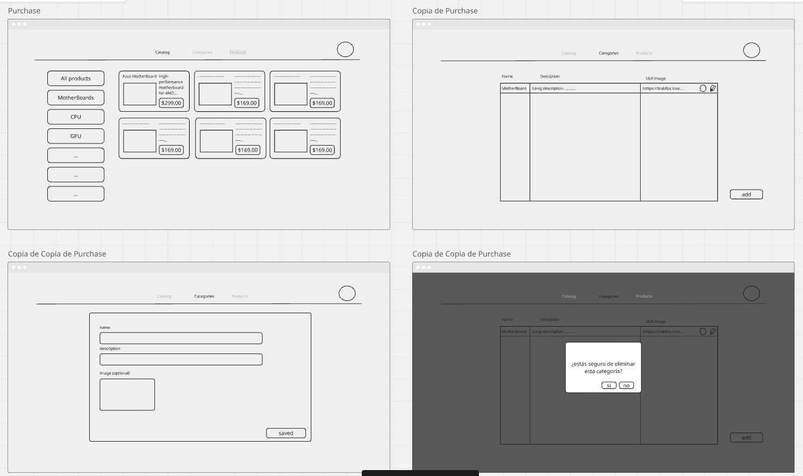

# Prueba Tecnica 

## FrameWorks

| Framework | Versión | Comentarios |
|-----------|---------|-------------|
| **Laravel** | v11+ | Peticion de la prueba 
| **React** | v18+ | He trabajado antes con React por lo que decidi usarlo| 
| **Inertia.js** | Latest | |¿

---

## Herramientas Instaladas para el Entorno

| Herramienta | Propósito | Comentarios |
|-------------|-----------|-------------|
| **Composer** | Gestor de paquetes PHP | |
| **Laravel Breeze** | Autenticación + React setup | En mi investigacion la forma mas sencilla de hacer un login era implementado breeze |
| **Node.js & NPM** | Runtime JavaScript | Nesarias para integrar React al proyecto |
| **SQLite** | Base de datos local | Para pruebas utilize SQLite, en un produccion lo podria cambiar a mySQL o PostgreSQL|

---

## IDE y Configuración

| Elemento | Descripción | 
|----------|-------------|
| **VS Code** | Editor principal |

## Comandos de Ejecución

| Comando | Terminal |
|---------|----------|
| `php artisan serve` |
| `npm run dev` | Terminal 2 |
| **URL:** `http://localhost:8000` | Navegador |

# Proceso del desarrollo

### **1. Investigación Previa (2 horas)**
Realizé una investigación inicial sobre Laravel ya que no tenía mucha experiencia con PHP. Hice comparaciones con frameworks que ya conocía para backend como **Ktor con Kotlin**. Investigué la integración de React con Laravel, dado que tenía experiencia previa con este framework de frontend.

**Decisión:** Por la facilidad de integración entre Laravel y React, decidí crear un proyecto utilizando estos dos frameworks, integrando **Laravel Breeze** para el sistema de autenticación.

### **2. Análisis de Requerimientos**
Analicé detalladamente los requerimientos de la prueba técnica y diseñé con **Miro** el concepto de una página de hardware de computadora para contextualizar el inventario.

### **3. Preparación del Entorno**
- Configuré **VS Code** como IDE principal
- Instalé herramientas necesarias: **PHP**, **Composer**, **Node.js**, **NPM**
- Creé el proyecto Laravel e integré React junto con Breeze

---

## **Backend - Laravel (2 horas)**

### Archivos Creados/Modificados

| Tipo | Archivo | Ruta | Propósito |
|------|---------|------|-----------|
| **Migration** | `create_categories_table.php` | `database/migrations/` | Estructura tabla categorías |
| **Migration** | `create_products_table.php` | `database/migrations/` | Estructura tabla productos |
| **Model** | `Category.php` | `app/Models/` | Modelo Eloquent categorías |
| **Model** | `Product.php` | `app/Models/` | Modelo Eloquent productos |
| **Controller** | `CategoryController.php` | `app/Http/Controllers/` | CRUD categorías |
| **Controller** | `ProductController.php` | `app/Http/Controllers/` | CRUD productos |
| **Controller** | `DashboardController.php` | `app/Http/Controllers/` | Catálogo principal |
| **Seeder** | `CategorySeeder.php` | `database/seeders/` | Datos de prueba categorías |
| **Seeder** | `ProductSeeder.php` | `database/seeders/` | Datos de prueba productos |
| **Routes** | `web.php` | `routes/` | Rutas de la aplicación |

**Comentario:** No había utilizado Laravel anteriormente, tuve algunos problemas iniciales con la sintaxis de PHP, pero resultó muy cómodo y práctico para desarrollar el backend.

---

##  **Frontend - React (3 horas)**

### Archivos Creados/Modificados

| Tipo | Archivo | Ruta | Propósito |
|------|---------|------|-----------|
| **Layout** | `AuthenticatedLayout.jsx` | `resources/js/Layouts/` | Barra navegación principal |
| **Component** | `DeleteConfirmModal.jsx` | `resources/js/Components/` | Modal reutilizable confirmación |
| **Page** | `Dashboard.jsx` | `resources/js/Pages/` | Catálogo de productos |
| **Page** | `Index.jsx` | `resources/js/Pages/Categories/` | Lista de categorías |
| **Page** | `Create.jsx` | `resources/js/Pages/Categories/` | Crear categoría |
| **Page** | `Edit.jsx` | `resources/js/Pages/Categories/` | Editar categoría |
| **Page** | `Index.jsx` | `resources/js/Pages/Products/` | Lista de productos |
| **Page** | `Create.jsx` | `resources/js/Pages/Products/` | Crear producto |
| **Page** | `Edit.jsx` | `resources/js/Pages/Products/` | Editar producto |
| **Config** | `app.jsx` | `resources/js/` | Configuración principal React |

##  **Tiempo Invertido (17-18 Julio 2025)**

| Fase | Tiempo | Detalles |
|------|--------|----------|
| **Requerimientos + Investigación** | 2 horas | Laravel research, React integration, Breeze setup |
| **Backend Development** | 2 horas | Models, migrations, controllers, seeders, routes |
| **Frontend Development** | 3 horas | React components, pages, layouts, styling |
| **Documentación** | 1 hora | README, capturas, video demo |
| **TOTAL** | **8 horas** | Tiempo efectivo de desarrollo |

---

## **Puntos a Mejorar**

-  Buscador en productos: El filtro por categorías en la búsqueda aún no está completamente integrado
- Upload de imágenes: Sistema de subida de archivos no implementado completamente
- Git: Crear branches específicos y commits más descriptivos

## URL youtube

https://youtu.be/RNnoCWq3MMI
| Comando | Terminal | Comentarios |
|---------|----------|-------------|
| `php artisan serve` | Terminal 1 | |
| `npm run dev` | Terminal 2 | |
| **URL:** `http://localhost:8000` | Navegador | |
